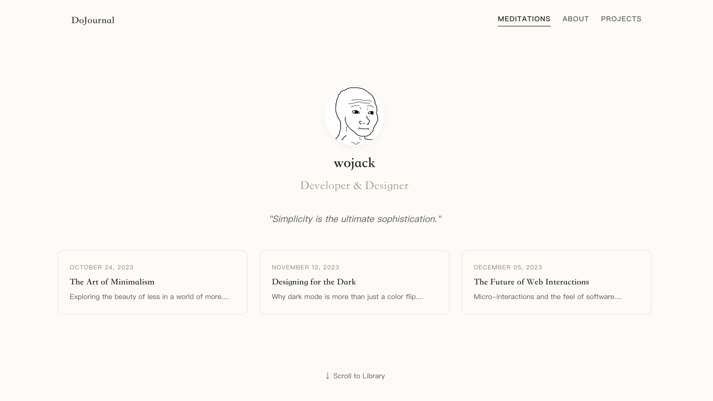

# DoJournal



A minimalist, elegant personal blog and portfolio built with React, TypeScript, and Vite. Designed with a "Gentle Cream" aesthetic, focusing on typography, whitespace, and smooth interactions.

## Features

*   **Horizontal Scroll Navigation**: A unique, page-turning experience between the Home, About, and Projects sections.
*   **Responsive Design**:
    *   **Desktop**: Fixed-width, two-column library layout for a consistent reading experience.
    *   **Mobile**: Fluid, single-column layout with a horizontal scrolling sidebar.
*   **Glassmorphism UI**: Subtle glass effects on cards and modals for a modern, airy feel.
*   **Interactive Animations**:
    *   Smooth scroll snapping.
    *   Fade-in effects using `framer-motion`.
    *   Card-to-modal transitions.
*   **Library Section**: A filterable list of realistic blog posts (Tech, Economy, Travel).

## Tech Stack

*   **Frontend**: React, TypeScript
*   **Build Tool**: Vite
*   **Styling**: CSS Modules / Global CSS (Variables-based theming)
*   **Animations**: Framer Motion
*   **Routing**: React Router DOM

## Getting Started

1.  **Clone the repository**:
    ```bash
    git clone <repository-url>
    ```

2.  **Install dependencies**:
    ```bash
    npm install
    ```

3.  **Run the development server**:
    ```bash
    npm run dev
    ```

4.  **Build for production**:
    ```bash
    npm run build
    ```

## Project Structure

```
/src
  /components   # Reusable UI components (Navbar, Sidebar, Modal, etc.)
  /pages        # Main page views (Home, About, Projects)
  /data         # Mock data for blog posts
  /styles       # Global styles and CSS variables
```

## License

MIT
